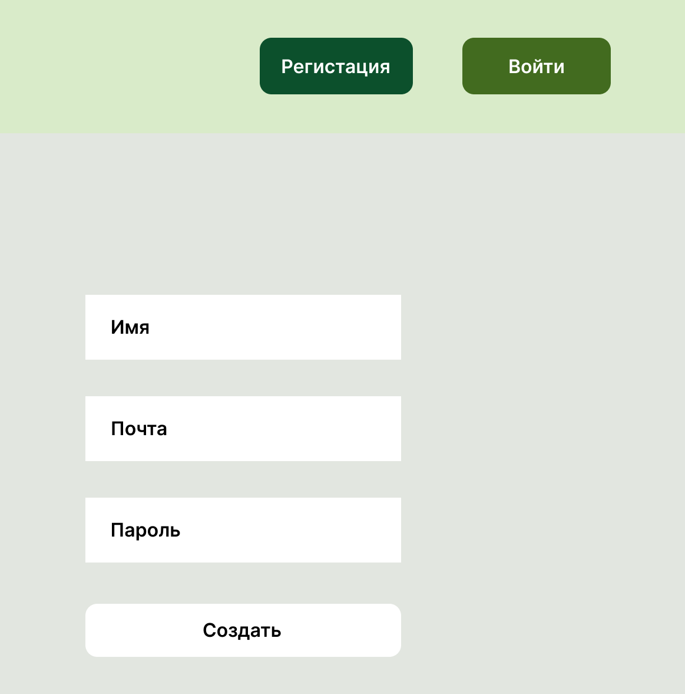
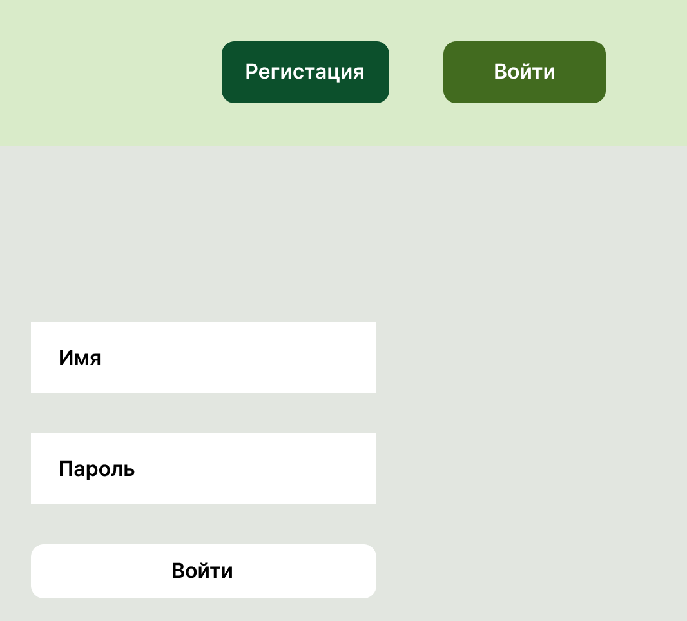
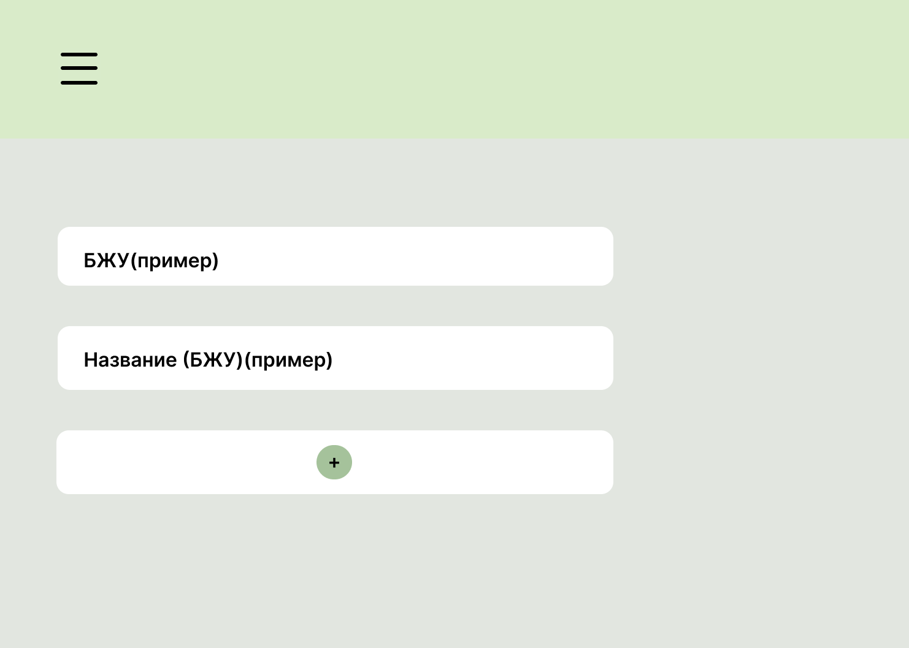

# Приложение для контроля питания

## 1. Введение

Это приложение для контроля питания. Оновная цель приложения это помочь пользователям следить за своим рационом и достигать своих целей в области здорового питания.

## 1.1 Границы и основные функции

Основные функции приложения:
- Ввод информации о потребляемых продуктах за день;
- Анализ и статистика о питании за день.

Приложение не будет выходить за рамки представленных функций. Пример: не будет генерироать график питания, не будет создавать меню и т.д.

## 2. Требования пользователя

## 2.1 Программные интерфейсы

Технологии проекта:
- Java(Spring Boot)
- JS/HTML/CSS
- Db(MongoDB)
- Git

## 2.2 Интерфейс пользователя

## Регистрация

## Вход

## Страница контроля питания

## 2.3 Характеристики пользователей

Приложение ориентировано на людей, которым нужен инструмент для мониторинга дневног рациона.
Приложением могут пользоватся только зарегестрированные пользователи, чтобы собирать статистику. Зарегестрированные пользователи имеют полный доступ ко всему функционалу.

## 2.4 Предположения и зависимости

- Веб-приложение: нужно подключение к интернету;
- Нужен аккаунт для доступа.

## 3. Системные требования

## 3.1 Функциональные требования

- Ввод информации о потребляемых продуктах за день;
- Анализ и статистика о питании за день;
- Хранение статистки;
- Редактирование дневного питания.

## 3.2 Нефункциональные требования

- Надежность (уверенность в том, что данные о питании будут сохранены и доступны в любое время)
- Безопасность (обеспечить защиту данных, аутентификацию и авторизацию пользователей)
- Удобство использования
- Масштабируемость

