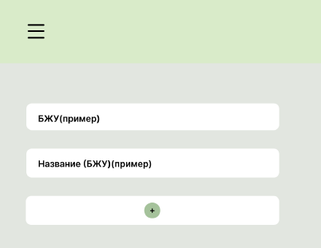

# Приложение для контроля питания

## 1. Введение

Это приложение для контроля питания. Оновная цель приложения это помочь пользователям следить за своим рационом и достигать своих целей в области здорового питания.

## 1.1 Границы и основные функции

Основные функции приложения:
- Ввод информации о потребляемых продуктах за день;
- Анализ и статистика о питании за день.

Приложение не будет выходить за рамки представленных функций.

## 2. Требования пользователя

## 2.1 Программные интерфейсы

Технологии проекта:
- Java
- JS
- Db(MongoDB)

## 2.2 Интерфейс пользователя

## Регистрация

## Вход

## Страница контроля питания

## 2.3 Характеристики пользователей

## 2.4 Предположения и зависимости

- Веб-приложение...

## 3. Системные требования

## 3.1 Функциональные требования

- Ввод информации о потребляемых продуктах за день;
- Анализ и статистика о питании за день.

## 3.2 Нефункциональные требования

